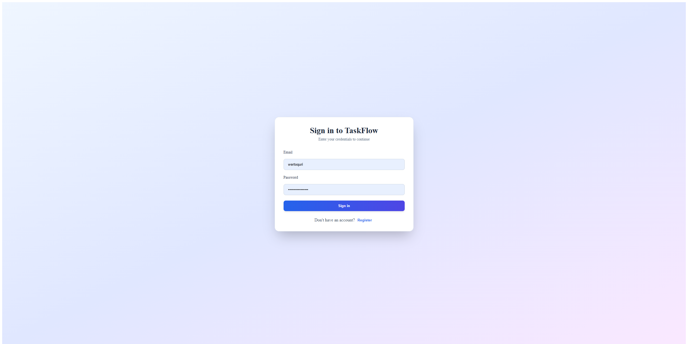
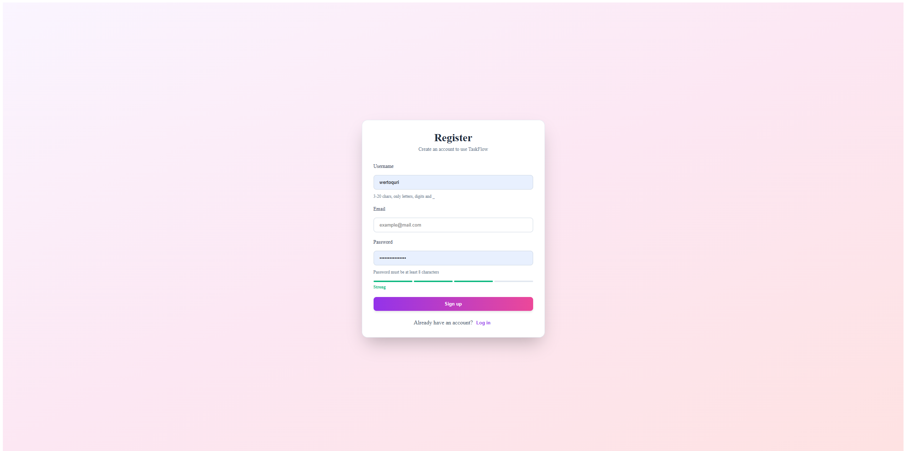
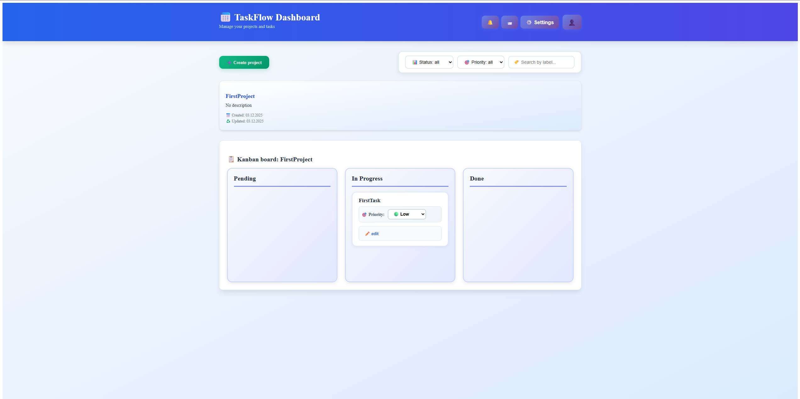
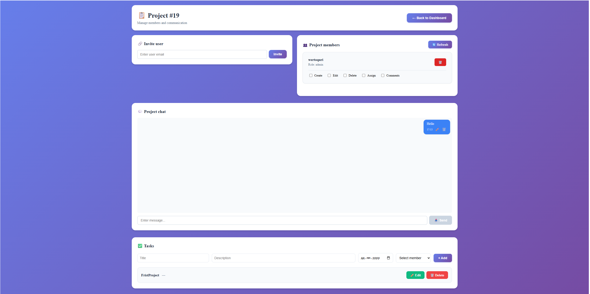

# TaskFlow

**TaskFlow** is a modern full-stack project and task management web application designed for small teams.  
It focuses on **clear ownership, real-time collaboration, secure authentication, and multilingual UI**.

Built with **React + Vite** on the frontend and **Node.js + Express + MySQL** on the backend.

<p align="center">
  <a href="#-problem-statement">Problem</a> ·
  <a href="#-key-features">Features</a> ·
  <a href="#-architecture-overview">Architecture</a> ·
  <a href="#-getting-started">Setup</a> ·
  <a href="#-screenshots">Screenshots</a> ·
  <a href="#-api-overview">API</a>
</p>

---

## 🧠 Problem Statement

Many task management tools are either too simplistic (no permissions, no real-time updates)  
or overly complex for small teams.

**TaskFlow** aims to solve this by providing:
- clear project ownership and role-based permissions
- real-time communication inside projects
- secure authentication with email verification
- built-in internationalization (UA / EN)
- predictable and maintainable backend architecture

---

## ✨ Key Features

- JWT authentication with **email verification (6-digit code)**
- Role-based access control (Owner / Admin / Member)
- Project & task management
- Real-time project chat (**Socket.IO**)
- Invitations & notifications
- Project activity log with admin cleanup
- User avatars (file uploads)
- Internationalization: **Ukrainian / English**
- Defensive database migrations

---

## 🏗 Architecture Overview

[ Browser ]
↓
[ React + Vite ]
↓ REST / WebSocket
[ Express API ]
↓
[ MySQL ]


### Frontend
- React + Vite
- React Router
- Axios
- Socket.IO client
- Context-based auth & i18n

### Backend
- Node.js + Express
- REST API
- Socket.IO for real-time events
- JWT authentication
- Nodemailer (email verification)
- MySQL with migrations

---

## 🔐 Authentication & Security

- Email + password authentication
- Mandatory email verification
- JWT stored in `localStorage`
- Role-based route protection
- File uploads stored outside source code
- Environment-based configuration

---

## 🌍 Internationalization (i18n)

- Centralized dictionary via `I18nContext.jsx`
- `t(key)` helper used across UI
- Ukrainian (`uk`) and English (`en`) supported
- Language switching without page reload

---

## 🗄 Database & Migrations

- MySQL as the primary database
- Defensive migrations ensure backward compatibility
- Optional columns (`avatar`, `avatar_url`, `nickname`) checked via `INFORMATION_SCHEMA`
- Migration files located in `backend/migrations`

---

## ⚖ Trade-offs & Limitations

- Express chosen over NestJS for simplicity and explicit control
- No background job queue
- Horizontal scaling would require shared state (e.g. Redis for sockets)

---

## 🚀 Future Improvements

- Redis for Socket.IO scaling
- Background jobs for email sending
- Improved test coverage
- Rate limiting and audit logs
- CI/CD pipeline (GitHub Actions)

---

## 📁 Repository Structure

backend/
├─ controllers/
├─ routes/
├─ migrations/
├─ scripts/
├─ db.js
└─ server.js

src/
├─ components/
├─ context/
│ ├─ AuthContext.jsx
│ └─ I18nContext.jsx
├─ api.js
└─ main.jsx


---

## ⚙ Getting Started 
### 1. Install dependencies
```bash
npm install

DB_HOST=localhost
DB_USER=mysql_user
DB_PASSWORD=mysql_password
DB_NAME=TaskFlow

JWT_SECRET=your_secret
PORT=5000

EMAIL_HOST=smtp.example.com
EMAIL_PORT=587
EMAIL_USER=smtp_user
EMAIL_PASS=smtp_pass
EMAIL_FROM="TaskFlow <noreply@example.com>"

cd backend
node scripts/run-migrations.js
node server.js
npm run dev
```
## 🖼 Screenshots 
### Login  
### Registration  
### Dashboard  
### Project Chat 


## 🔌 API Overview
Base URL: `http://localhost:${PORT}/api`

- Auth
	- `POST /register` — register user (returns `userId`, email)
	- `POST /verify-email` — verify with 6‑digit code (returns `token`, `user`)
	- `POST /login` — login (returns `token`, `user`)
	- `GET /me` — current user
	- `DELETE /account` — delete current account

- Projects
	- `GET /projects` — list projects
	- `POST /projects` — create project
	- `PUT /projects/:id` — update project
	- `DELETE /projects/:id` — delete project

- Tasks
	- `GET /tasks/:projectId` — list tasks for a project
	- `POST /tasks` — create task
	- `PUT /tasks/:id` — update task
	- `DELETE /tasks/:id` — delete task

- Invitations
	- `POST /projects/:projectId/invite` — invite user by email
	- `GET /projects/me/invitations` — current user pending invites
	- `POST /projects/invitations/:id/accept` — accept invite
	- `POST /projects/invitations/:id/decline` — decline invite

- Members
	- `GET /projects/:projectId/members` — list members
	- `DELETE /projects/:projectId/members/:userId` — kick member
	- `PUT /projects/:projectId/members/:userId/permissions` — update permissions

- Notifications
	- `GET /notifications` — list notifications
	- `PUT /notifications/read-all` — mark all read
	- `PUT /notifications/:id/read` — mark single read
	- `DELETE /notifications/:id` — delete notification

- Chat
	- `GET /projects/:projectId/messages` — list messages
	- `POST /projects/:projectId/messages` — send message
	- `PUT /projects/:projectId/messages/:messageId` — edit message
	- `DELETE /projects/:projectId/messages/:messageId` — delete message

 - ## 📄 License

This project is licensed under the [MIT License](https://github.com/Wertoquri/TaskFlow/blob/main/LICENSE).

---
