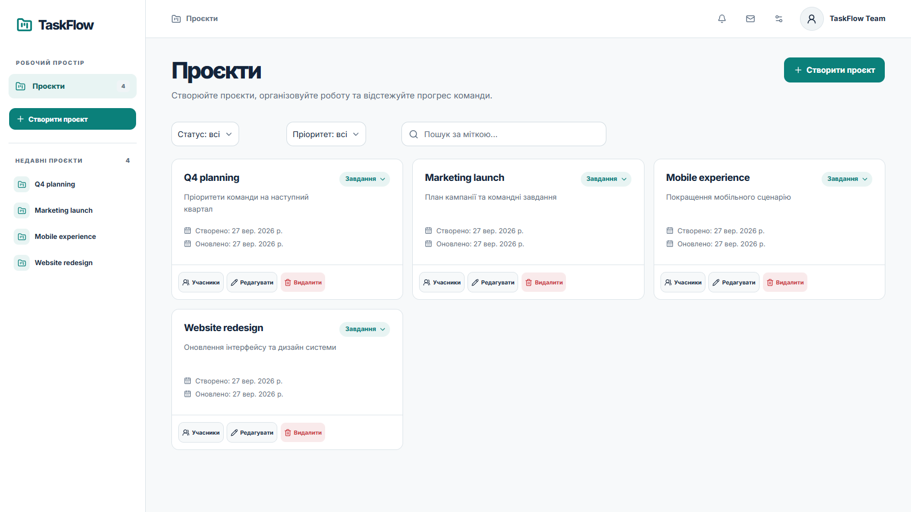

# TaskFlow

TaskFlow is a bilingual project-management application for small teams. It demonstrates role-based access, Kanban workflows, invitations, notifications, file attachments and real-time project chat.



## Client demo

```bash
docker compose up --build
```

Open http://localhost:3000 and sign in with:

- Email: `demo@taskflow.local`
- Password: `TaskFlowDemo2026!`

The container creates the PostgreSQL schema and a populated demo workspace automatically. SMTP is replaced by a console mailer in demo mode; production SMTP remains configurable.

## Demo walkthrough

1. Sign in and open **Website launch**.
2. Move work through the Kanban columns and edit priorities.
3. Open project chat and show live updates in a second browser.
4. Invite a user, inspect permissions and review project activity.
5. Switch between Ukrainian and English.

## Architecture

```text
React/Vite + Socket.IO client
           | REST / WebSocket
Express API + JWT
     |            |
PostgreSQL    Cloudinary media
```

## Local development

Prerequisites: Node.js 22+ and a running PostgreSQL database. Set `DATABASE_URL` and a unique `JWT_SECRET` in `.env` before starting the app. `EMAIL_MODE=console` is suitable for local registration testing.

```bash
cp .env.example .env
npm ci
npm --prefix backend ci
npm --prefix backend run migrate
npm run dev
```

On PowerShell, use `Copy-Item .env.example .env` instead of `cp` if preferred. `npm run dev` starts the API, checks its database health, and then starts Vite. This prevents a frontend-only server from showing a failing registration page. For frontend-only work, use `npm run dev:web`.

For a PostgreSQL cluster kept outside the repository, an optional ignored `.taskflow-local-db.json` lets `npm run dev` start it when needed:

```json
{ "pgCtl": "C:/path/to/PostgreSQL/bin/pg_ctl.exe", "dataDir": "C:/path/to/local/data", "port": 5433 }
```

Its port must match the localhost port in `DATABASE_URL`. This configuration is only for local development.

Frontend: http://127.0.0.1:3000. API health: http://127.0.0.1:5000/api/health. If the API health check fails, verify that PostgreSQL is running and that the `DATABASE_URL` role and database exist.

## Free portfolio deployment

The repository includes `render.yaml` for a single public Render URL. In production, Express serves both the API and the built React application, including SPA routes and Socket.IO.

1. Create a free Neon Postgres project and copy its pooled connection string.
2. Create a free Cloudinary account and copy `CLOUDINARY_URL`.
3. Open this repository as a Render Blueprint.
4. Fill the secret variables marked `sync: false` in the Render dashboard.
5. Deploy and verify `/api/health`, login, Kanban drag-and-drop, chat and uploads.

Required production variables:

```env
DATABASE_URL=postgresql://...
JWT_SECRET=
DEMO_PASSWORD=
CLOUDINARY_URL=
NODE_ENV=production
```

The free Render service sleeps after inactivity, so the first request can take about a minute. This setup is suitable for a portfolio demo, not a production SLA.

## Quality checks

```bash
npm run lint
npm run build
npm --prefix backend test
npm run verify
docker compose config
```

GitHub Actions runs the same checks for every pull request and push to `main`.

## Security notes

- Secrets are supplied only through environment variables.
- Passwords are hashed with bcrypt and authenticated endpoints require JWT.
- Password recovery is available from the sign-in page: a six-digit email code expires after 15 minutes, allows five attempts and is issued at most once per minute. Resetting the password revokes previous JWT sessions. Configure SMTP or the [TaskFlow HTTPS email relay](email-relay/README.md) for delivery. The relay uses separate subjects and visual templates for verification and password reset.
- `EMAIL_MODE=console` and seeded credentials are intended only for local demonstrations.
- Production requires a unique `JWT_SECRET`; media is stored outside the ephemeral app filesystem.

## Technology

React 19, Vite, Express 5, Socket.IO, PostgreSQL/Neon, Cloudinary, JWT, Nodemailer and Docker Compose.

MIT licensed.
